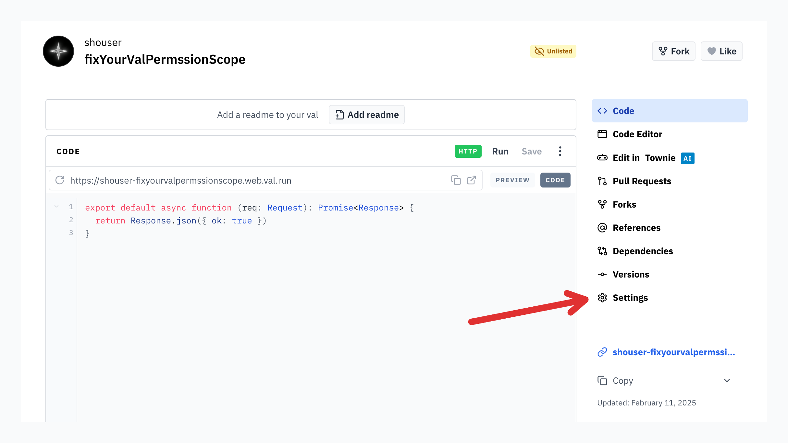

On February 11th, 2025, we migrated all remaining users' vals to the safer API scopes scopes. This change was [announced in this blog post](https://blog.val.town/blog/api-token-scopes/) on Nov 1, 2024. At that time, the changes applied only to the users who were not using the `val:write` scope, so as to give users who would be affected time to upgrade their vals. As of February 11th, 2025, all user's vals default to these safer scopes. In particular, the `vals:write` permission is missing from your vals, unless and until you explicitly add it in your val's settings.

One of the most common uses of the `val:write` permission is the now-deprecated [std.set](https://www.val.town/v/std/set) function, since it modifies another val. If you're seeing an error with `std/set`, there are two actions you can take:

## Use Blob Storage Instead (recommended)

Std/set is deprecated and we now use blob storage instead. You can use the [std/blob](https://www.val.town/v/std/blob) library and learn more [in our docs](https://docs.val.town/std/blob/).

## Add Val Write Permissions to Your Val

Alternatively, you can update your val's permission scopes so it can create or modify other vals again. To do this:

### 1. Go to your val's Settings

### 2. Scroll down to the Permissions section and select the Vals dropdown

### 3. Select Read and Write

You're good to go!